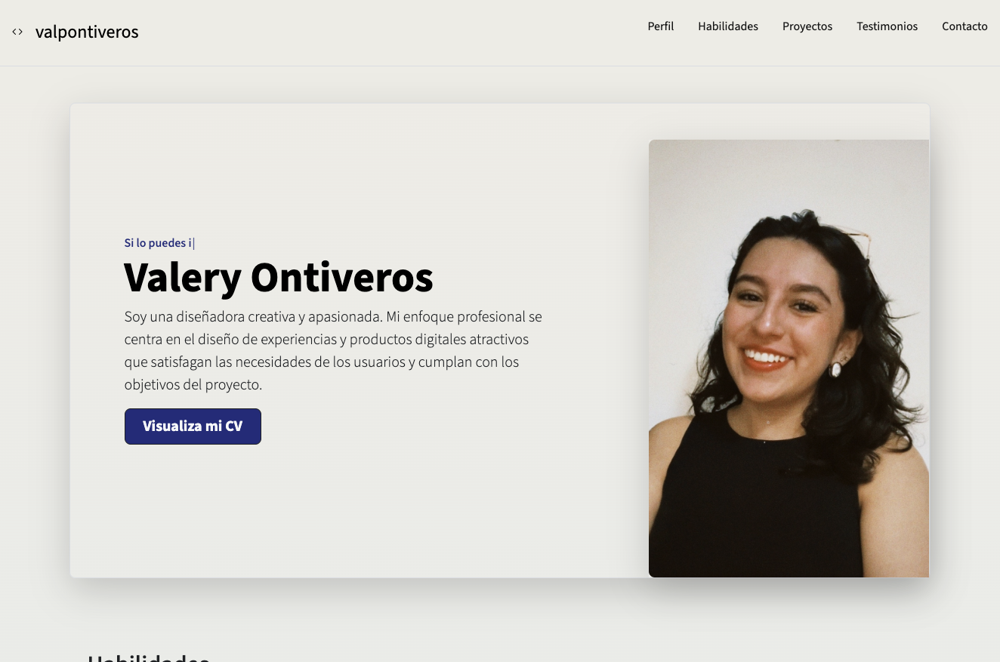

## Portafolio de proyectos

¡Hola! Soy **Valery Ontiveros**, Diseñadora UX/UI y Desarrolladora Web Jr.
Apasionada por los productos digitales y las experiencias que brindan a los usuarios. Aquí encontraras información sobre mi experiencia. ✨

____

### El proyecto cuenta con las secciones de: 
- 🔍 Sobre mi
- 🛠 Habilidades
- 💼 Proyectos
- 🗣 Testimonios
- ✉️ Contacto 

### Creado con:
- HTML
- CSS
- JavaScript
- 

    
    
   
### Vista Previa

### *Lista para nuevos desafíos* 
Contactame por correo para platicar  como puedo aportar valor a tu equipo

*Correo*

[valontiveros99@gmail.com](mailto:valontivero99@gmail.com)

*LinkedIn*

[Click aquí para ir a mi LinkedIn](https://www.linkedin.com/in/valery-ontiveros/)

### Creado en el bootcamp TecnolochicasPro 💜
[Tecnolochicas](https://tecnolochicas.mx/)